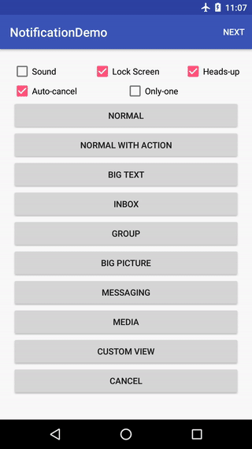

## Notification
> **A sample app show Android notification features.**


### MainActivity
----


### Normal notification
----


### Normal notification with actions
----


### Big text notification
----


### Inbox notification
----


### Bundled notification
----


### Big picture notification
----


### Messaging notification
----


### Media notification
----


### Custom view notification
----



### License

```
NotificationDemo for Android
Copyright (c) 2017 Smile Wei (http://github.com/EasyToForget).

Licensed under the Apache License, Version 2.0 (the "License");
you may not use this file except in compliance with the License.
You may obtain a copy of the License at

http://www.apache.org/licenses/LICENSE-2.0

Unless required by applicable law or agreed to in writing, software
distributed under the License is distributed on an "AS IS" BASIS,
WITHOUT WARRANTIES OR CONDITIONS OF ANY KIND, either express or implied.
See the License for the specific language governing permissions and
limitations under the License.
```
